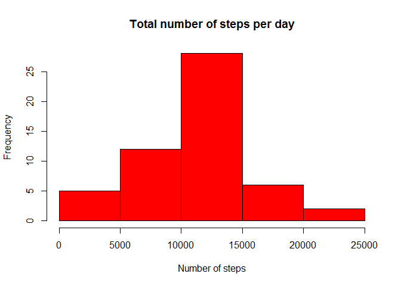
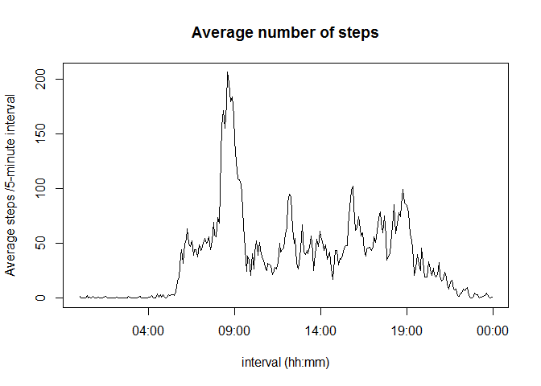
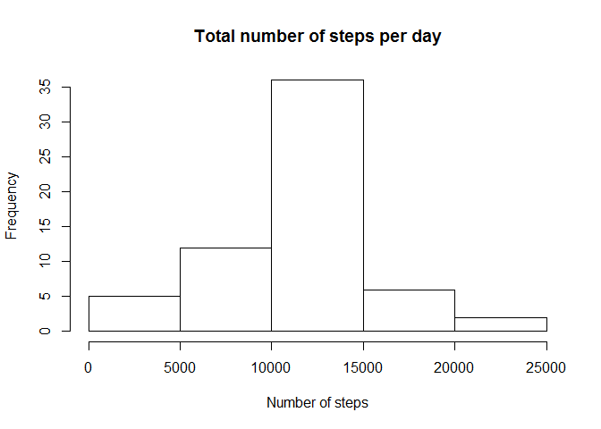
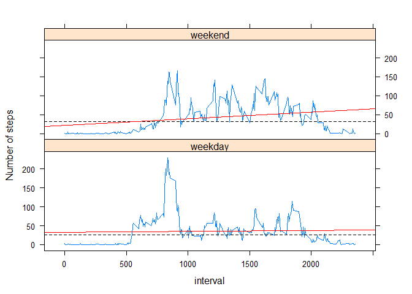

# Reproducible Research: Peer Assessment 1


## Loading and preprocessing the data

I unzip the code and load the data with this code:

```r
if (!file.exists("activity.csv")) {
unzip("activity.zip", 
      "activity.csv", exdir = "./")
}

activity <- read.csv("activity.csv", header = TRUE)
```
## What is mean total number of steps taken per day?


```r
library(dplyr)
steps <- activity%>% group_by(date) %>% summarise(steps=sum(steps))

 with(subset(steps, !is.na(steps)), hist(steps, main = "", xlab = "", 
                                         col = "red"))

title( xlab = "Number of steps", main = "Total number of steps per day")
```

<!-- -->
 
 
The **mean** number of steps is :**1.07662\times 10^{4}**  
The **median** number of steps is :**10765**  
The **mean** is slightly greater than **median**


## What is the average daily activity pattern?

```r
mn <- activity%>%
  group_by(interval) %>% summarise(mean = mean(steps, na.rm=TRUE))


mn$interval <- strptime(sprintf("%04d",mn$interval), format = "%H%M")
plot(mn$interval, mn$mean, type = "l", main = "Average number of steps",
              xlab = "interval (hh:mm)", ylab = "Average steps /5-minute interval")
```

<!-- -->

The maximum number of steps is at:
08:35

------

The number of missing values NA :  
Only the steps variable have missing values


```r
colSums(is.na(activity))
```

```
##    steps     date interval 
##     2304        0        0
```


## Imputing missing values


```r
d <- activity%>%
  group_by(interval) %>% summarise(mean = mean(steps, na.rm=TRUE))


 #replace each missing by 5-minute interval mean

activity_fill <- activity

for (i in 1:17568){
  if (is.na(activity_fill[i, 1])){
    
  activity_fill[i,1]<- d[grep(activity_fill$interval[i], d$interval ),2]  
  
  }
}
```


```r
steps <- activity_fill%>% group_by(date) %>% summarise(step  =sum(steps))

with(steps, hist(step, main = "", xlab = ""))

title( xlab = "Number of steps", main = "Total number of steps per day")
```

<!-- -->

-The **mean**  number of steps is :**1.0766189\times 10^{4}**  
-The **median** number of steps is : **1.0766189\times 10^{4}**  
-The **mean** and the **median** are equal. So the imputation has normalize 
the steps  

## Are there differences in activity patterns between weekdays and weekends?


```
## [1] "English_United States.1252"
```


```r
activity_fill$week <- ifelse(
  weekdays(strptime(activity_fill$date, format = "%Y-%m-%d"))
  %in% c("Saturday", "Sunday"), "weekend", "weekday")
Sys.setlocale("LC_TIME", my_lc_time)
```

```
## [1] "French_France.1252"
```

```r
activity_fill$week <- factor(activity_fill$week)

average <- activity_fill %>% group_by(interval, week)%>%
  summarise(step=mean(steps))


library(lattice)

xyplot(step~interval|week, data = average, type= "l", layout= c(1,2),
       ylab = "Number of steps", panel = function(x, y, ...){
         panel.xyplot(x, y,  ...)
         panel.abline(h = median(y), lty = 2)
         panel.lmline(x, y, col=2)
       }
)
```

<!-- -->

**There is differeent pattern between weekdays and weekends as shown by the**
**graph above**  


